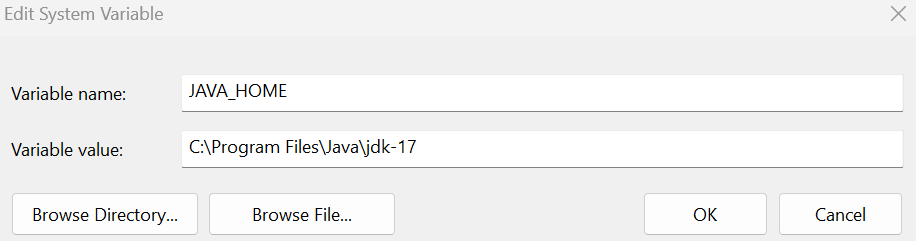
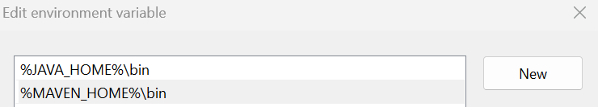
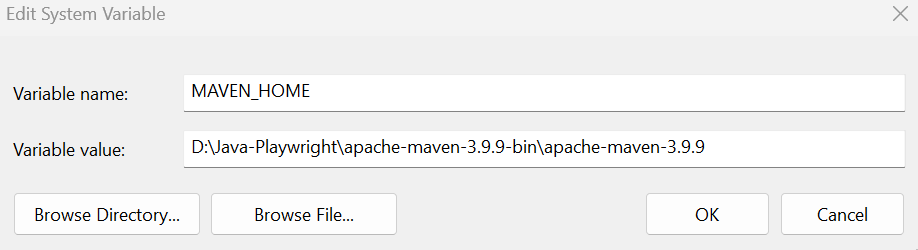
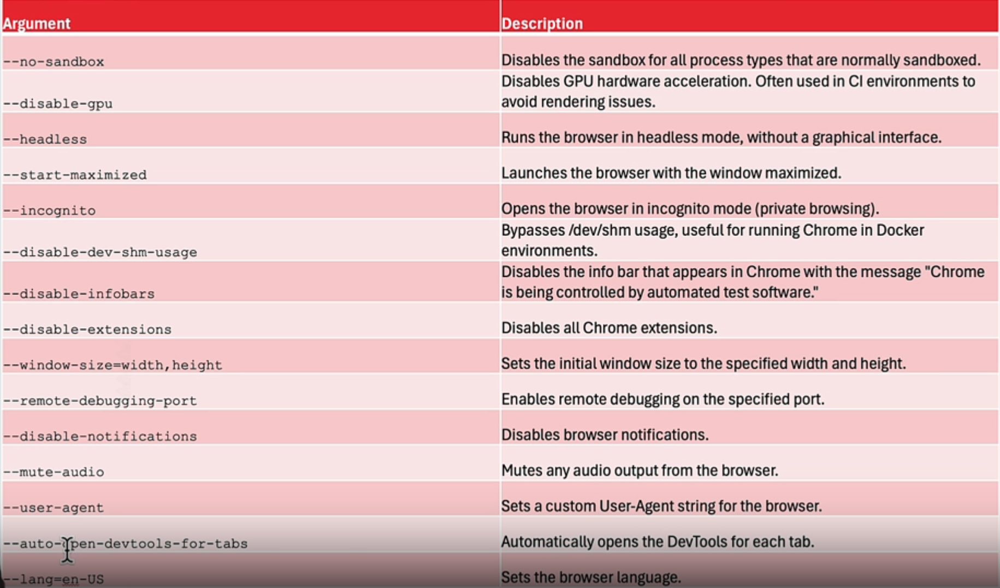
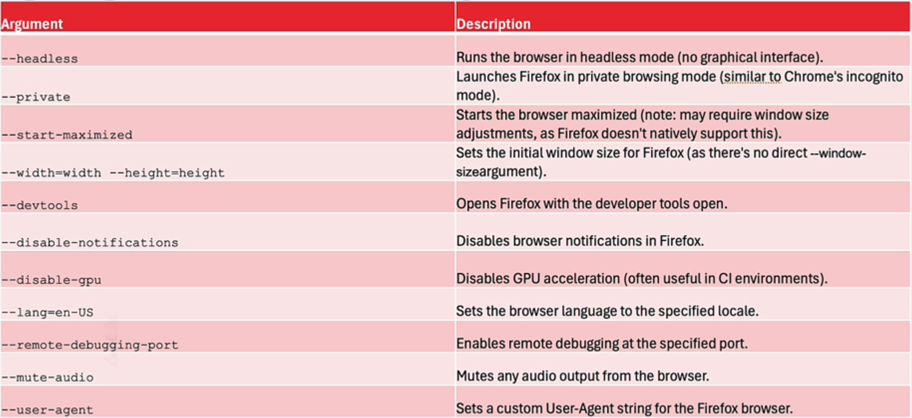
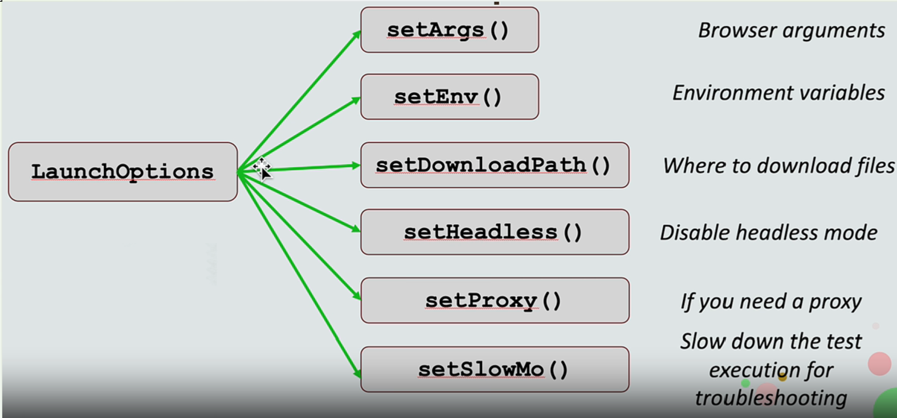

Playwright with Java
===
# 1. Introduction
- Playwright was created specifically to accommodate the needs of end-to-end testing.
- Playwright supports all modern rendering engines including Chromium, WebKit, and Firefox.
- Playwright is distributed as a set of Maven modules.
- The easiest way to use it is to add one dependency to project's pom.xml 

# 2. Setup

## 2.1 JAVA 
    Download: https://www.oracle.com/java/technologies/javase/jdk17-archive-downloads.html
- Add path for java

## 2.2 MAVEN
    Download: https://dlcdn.apache.org/maven/maven-3/3.9.9/binaries/apache-maven-3.9.9-bin.zip
- Add path for Maven

## 2.3 IDE
    Download: https://www.jetbrains.com/idea/download/?section=windows
## 2.4 Add dependencies into pom.xml

    <dependencies>
        <dependency>
            <groupId>com.microsoft.playwright</groupId>
            <artifactId>playwright</artifactId>
            <version>1.47.0</version>
            <scope>test</scope>
        </dependency>
        <dependency>
            <groupId>org.junit.jupiter</groupId>
            <artifactId>junit-jupiter</artifactId>
            <version>5.11.1</version>
            <scope>test</scope>
        </dependency>
    </dependencies> 

# 3. My first test case
    @UsePlaywright
    public class SimpleTestCase {
    @Test
    void checkTitle(Page page) {

        page.navigate("https://github.com/quangkhaik62/java-playwright");
        String title = page.title();
        Assertions.assertTrue(title.contains("java-playwright"));
        System.out.println(title);
    }
    @Test
    void interactwithelement(Page page) {
        page.navigate("https://practicesoftwaretesting.com/");
        page.locator("#search-query").fill("Pliers");
        page.locator("button:has-text('Search')").click();
        int numberofproduct = page.locator(".card").count();
        Assertions.assertTrue(numberofproduct > 0);
        System.out.println(numberofproduct);
    }
    }

- Create a Playwright: Playwight playwright = Playwright.create();
- Run a Browser: Browser browser = playwright.<browser>().launch();
- Open a Page: Page page = browser.newPage();
- Navigate to a URL: page.navigate();
- Check conditions: Assertions.<>();
- Annotaion: @UsePlaywright @Test @BeforeEach @AfterEach

Note: Default playwright launch browser with headless type, we can change it to Headed by setHeadless() in launch().

# 4. Playwright Architecture: Browsers, Browser Contexts and Pages

## 4.1 Browser options

## 4.2 Browser context
    Playwright
        └── Browser (Chromium, Firefox, Webkit)
            └── BrowserContext (Session 1)
                │       └── Page (Tab 1)
                │       └── Page (Tab 2)
                └── BrowserContext (Session 2)
                        └── Page (Tab 1)

- browserContext = browser.newContext(): Create a new BrowserContext.
- browserContext.newPage(): Create a page inn browser context.